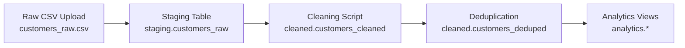

# 🧹 Data Cleaning & Transformation Pipeline

[](https://www.postgresql.org/)
[](https://www.docker.com/)
[](https://dbeaver.io/)
[](LICENSE)

---

## 📌 Overview

This project demonstrates a robust **ETL pipeline** using SQL, PostgreSQL, and Docker to clean, deduplicate, and transform messy customer data from CSVs into analytics-ready views.

### 🔁 Pipeline Flow:


---

## ⚙️ Tech Stack
| Tool         | Purpose                             |
| ------------ | ----------------------------------- |
| PostgreSQL   | Database backend                    |
| Docker       | Containerized Postgres service      |
| DBeaver      | GUI client for SQL interaction      |
| SQL          | Data transformation & view creation |
| Python Faker | Mock CSV generator                  |

---

## 📁 Project Structure
```text
data_cleaning_transform/
│
├── data/
│   └── customers_raw.csv                # Raw messy CSV
│
├── sql/
│   ├── 01_create_schemas.sql
│   ├── 02_create_staging_table.sql
│   ├── 03_data_cleaning.sql
│   ├── 04_deduplication.sql
│   ├── 05_analytics_views.sql
│
├── init/
│   └── 01_create_schemas.sql           # Auto-run by Docker
│
├── generate_customers_raw.py           # Python mock data generator
├── docker-compose.yml                  # Postgres setup
└── README.md
```

---

## 🚀 Getting Started
🔹 1. Start PostgreSQL with Docker
```bash
docker compose up -d
```

🔹 2. Connect with DBeaver
  * Host: localhost
  * Port: 5432
  - Host: localhost
  - Port: 5432

🔹 3. Import CSV into Staging Table
  * Use DBeaver's "Import Data" to load customers_raw.csv into staging.customers_raw.

---

## 🧼 Data Cleaning Logic
✅ Cleaning Tasks:
 * Normalize names (strip special chars, fix casing)

 * Normalize phone numbers (10-digit clean)

 * Auto-parse flexible date formats:

    * MM/DD/YYYY, DD/MM/YYYY, DD-Mon-YY

 * Trim and lowercase email addresses

✅ Deduplication:
 * Keep most recent signup for each unique name + email

---

## 🧪 Data Validation

- ✅ Null checks on all critical fields
- ✅ Format verification for phone and email
- ✅ Date parsing with regex safety
- ✅ Row count comparisons before/after deduplication

---

## 📊 Analytics Views
| View                           | Description                        |
| ------------------------------ | ---------------------------------- |
| `analytics.customer_summary`   | Cleaned customer info              |
| `analytics.signup_trend`       | Monthly customer acquisition trend |
| `analytics.email_domain_stats` | Most common email providers        |

---

## 📈 Dashboard Suggestions

* 📊 Line Chart: Monthly signups

* 📋 Table: Cleaned customer records

* 📨 Bar Chart: Email provider usage

---

## 🧠 Future Enhancements
* Add dbt for modular SQL transformations

* Schedule refresh using Apache Airflow

* Integrate with Power BI or Tableau

* Add fuzzy deduplication with Levenshtein distance

* Include data quality tests and alerts

---

## 👨‍💻 Author

**Derek Acevedo**  
_Data Engineer \| SQL Enthusiast \| Open Source Contributor_  
[GitHub](https://www.github.com/poloman2308) \| [LinkedIn](https://www.linkedin.com/in/derekacevedo86)
